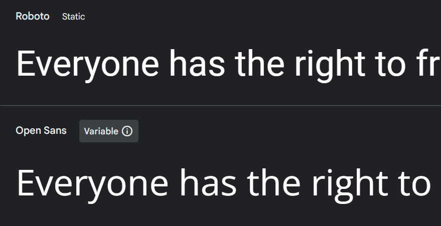

<h1 align="center">
<picture>
  <source media="(prefers-color-scheme: dark)" srcset="https://raw.githubusercontent.com/luruanx/Projeto-SUSDEG/1cdd9b7de3ede7685009e99718c946335076d9df/assets/img/logo%20susdeg%20white%20300.svg">
  <source media="(prefers-color-scheme: light)" srcset="https://raw.githubusercontent.com/luruanx/Projeto-SUSDEG/1cdd9b7de3ede7685009e99718c946335076d9df/assets/img/logo%20susdeg%20black%20300.svg">
  
</picture>
    
SUSDEG – APP COM SISTEMA DE RECOMPENSA EM PROL DA MOTIVAÇÃO E INTERAÇÃO DO MUNDO COM AS ODS 

</h1>

 
    <a href="#Layout-Web">Layout Web</a> |
    <a href="#Protótipo">Protótipo</a> |
    <a href="#Sobre">Sobre</a> |
    <a href="#Contato">Contato</a>

 

### Resumo:
O objetivo principal deste projeto é a criação de um aplicativo que irá fazer mudanças inconscientes, moldando o usuário que se cadastrou com o intuito de ganhar dinheiro, e assim resultando em uma mudança de princípios e crenças, que a partir da prática diária, será conscientizado do quão importante e necessário é, cada indivíduo fazer seu papel em prol de um mundo melhor! 

### Desenvolvido até aqui:

- [x] Layout Apresentação Web
- [x] Protótipo Design do App
- [ ] Desenvolvimento do APP
- [ ] Monetização
- [ ] Testes e ajustes

### Tecnologias Utilizadas:

  
  
  
  
  

  
 
---

### Layout Web:
Page desenvolvida para apresentar protótipo inicial, priorizando o [HTML Semântico](https://github.com/luruanx/Projeto-SUSDEG/blob/main/index.html) e as
[CSS responsiva](https://github.com/luruanx/Projeto-SUSDEG/blob/main/assets/style.css). 
 
 

 
    <a href="https://luruanx.github.io/Projeto-SUSDEG/#">Clique aqui e veja o resultado</a>

https://github.com/luruanx/Projeto-SUSDEG/assets/155588491/d439991e-0818-4c55-974a-e163894b0877

 
 

 
    <a href="https://luruanx.github.io/Projeto-SUSDEG/#">Responsivo em qualquer tamanho de tela</a>

https://github.com/luruanx/Projeto-SUSDEG/assets/155588491/b47da7d0-ffbb-414e-86b4-54149cd4ec2d

 

## Protótipo:

Com uma interface amigável e recursos interativos, o SUSDEG visa inspirar ações positivas para um futuro mais verde e justo. Aqui está uma descrição das 10 telas iniciais que esboçam a estrutura e o funcionamento deste aplicativo revolucionário. [Clique aqui](https://www.figma.com/file/oPTfRfsUhZZTe23Hl1AQCa/SUSDEG?type=design&node-id=0%3A1&mode=design&t=aoCOeqS0BKpAdOXB-1) e vizualize no FIGMA.

 
  

## Sobre:

- ### Como surgiu a ideia? 

  Escolher uma das 17 ODS, como tema para desenvolver um projeto usando uma tecnologia de minha preferência. Esse foi o requisito para usar a criatividade e mostrar os conhecimentos adquiridos na graduação até o momento presente (4º período). [Clique aqui](assets/pdf/Levantamento%20do%20projeto.pdf) e veja o levantamento inicial do desenvolvimento.  

- ### O porque do nome **SUSDEG**?

   A ideia surgiu em meio as pesquisas em conteúdos inglês, onde o **SUS** são as letras iniciais da palavra **SUSTAINABLE**, **DE** é da palavra **DEVELOPMENT** e **G** da palavra **GOALS**. 

- ### Identidade Visual

  **Logomarca:** Duas mãos postas em um globo, simbolizando apoio ao planeta terra, e em volta há 2 ramos de oliveira que simboliza paz e vitória.    

  

    
    
    
  
  

  **Paleta de Cores:** 

    
  

    
  
    

  **Font-Family:**

   

  

    

---

### Contato:

  

  Estou total aberto a conselhos, elogios ou sugestões. **"Todo conhecimento é bem vindo!"**, dar um alô aí!!

   

